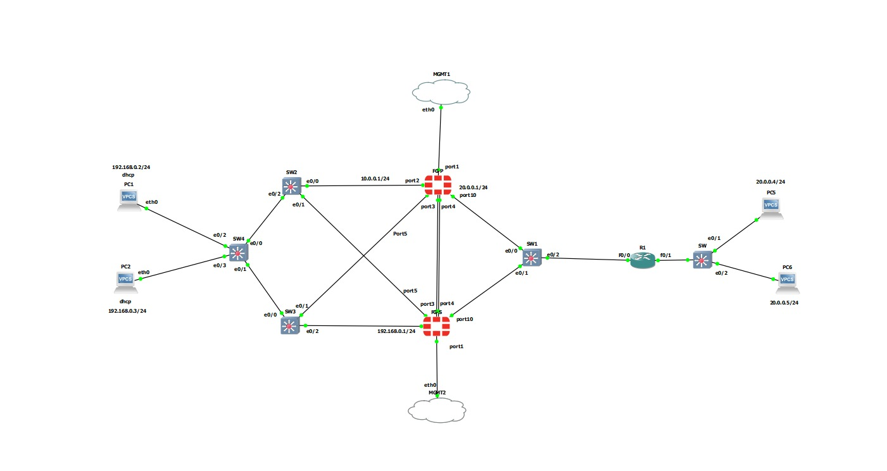
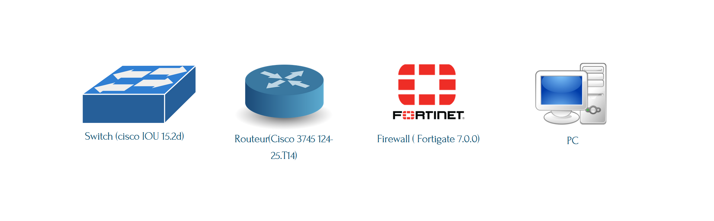

# Architecture d'entreprise H.A 
# Introduction

In today's digital landscape, where service availability is crucial for the smooth operation of businesses, the concept of High Availability (HA) stands as a fundamental pillar. [**project**](presentation.pdf) delves into the implications, challenges, and solutions inherent in implementing an architecture that ensures maximum availability of computer systems within an enterprise.

We explore High Availability (H.A.) in computing, delving into its foundations, technologies, and key practices. We examine HA models, from active-passive systems to distributed architectures, while analyzing emerging challenges and trends. The goal is to provide practical recommendations for ensuring continuous availability of computer systems .

**Architecture** :

Here is the architecture we have proposed within the context of our project.

**Technologies** :

-Firewall ( **Fortigate 7.0.0**) 
-Switch (**cisco IOU 15.2d**) 
-Routeur (**Cisco 3745 124-25.T14**) 

**Protocoles** :

-**Spanning Tree**: To prevent the formation of loops and ensure path redundancy without creating traffic loops. 
-**VRRP**: Used to create a virtual default gateway, allowing multiple routers to share an IP address and provide redundancy in case of router failure. 
-**HSRP**: Provides redundancy for routers by providing a virtual default gateway within a local network.  

**Tools** :

  
  

**Conlusion** :

If you're interested in exploring the technical aspects of the project further and gaining insight into the configuration of technologies, I encourage you to take a look at the [**presentation**](presentation.pdf). It provides a detailed overview of this aspect and offers a deeper understanding of the project's technical components.
